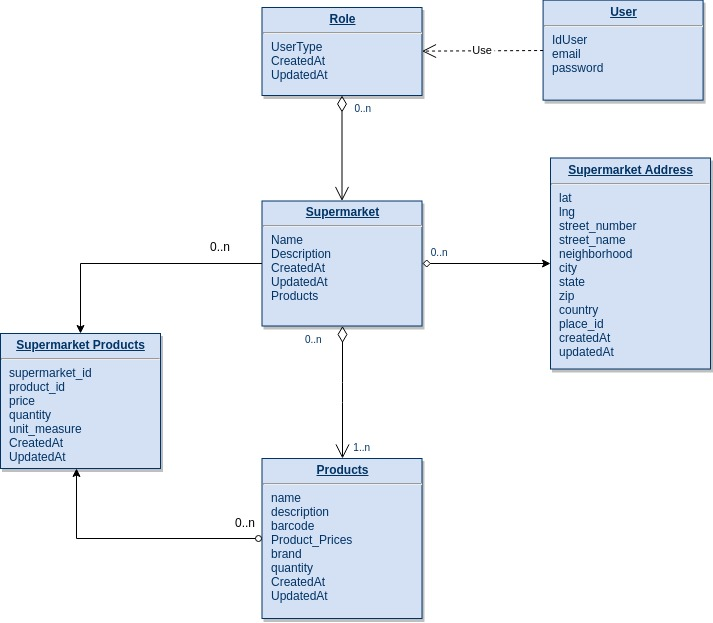

# Supermarket API
Supermarket back-end.

That API is used for create new supermarkets with products where each product have a smallest and highest price and you can search by bar code.  

---

## Requirements

* **[Docker 17.05.0-ce](https://www.docker.com/)**
* **[docker-compose 1.11.2](https://docs.docker.com/compose/)**

### Installation

**In the path cloned folder**
 
* Set a .env with correct informations, you can find an example in .env.development.sample **the create-db command won't work without it**
* To set the application, follow the commands bellow:

 ```  
  make build
  make create-db
  make yarn-install
  make up
 ```
  
  
---


## Swagger Docs

If you want to access and check all end-points and formats necessary, access in your browser: `http://localhost:3000/v1/docs`
  
---

## Entity Data Model Diagram



## Json Formats

The JSON response is following [jsonapi.org](http://jsonapi.org/format/) which you have for example:

```
  {
    "data": {
      "type": "supermarket",
      "id": "1",
      "attributes": {
        // ... this supermarket's attributes
      },
      "relationships": {
        // ... this supermarket's relationships
      }
    }
  }
```

## Contributors

> Cláudio Djohnnatha ([cdjohnnatha](https://github.com/cdjohnnatha)) cdjohnnatha@gmail.com

---
